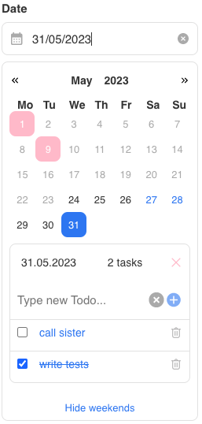
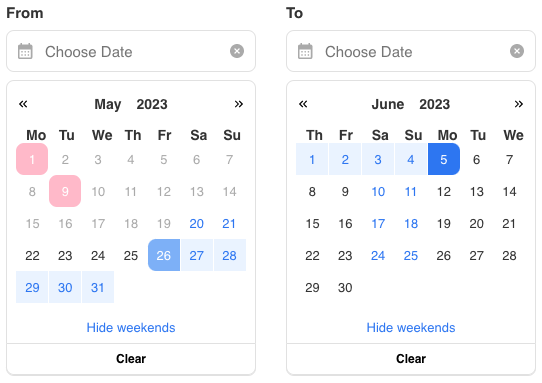

# Description




Basic and extensible Javascript library Date Picker for working with different types of calendar. Includes DayPicker and RangePicker components.

- Supports ability to jump to a user-specified date in the calendar.
- Supports ability to add a list of tasks when clicking on a specific day and save them to localStorage.
- Supports possibility to switch to previous/next week/month/year.
- Supports possibility to select the minimum and maximum date of the calendar.
- Supports ability to hide/show weekends and highlight holidays in a different color.
- Supports selecting the calendar type (by year, week and month).
- Supports selecting a range for the calendar.
- In the RangePicker component, the first calendar provides a start date selection on both click and input from the DateSelector component panel. Similarly for the end date of the period in the second calendar. This provides more convenient functionality for the user to view the selected period and change it. This library is extensible, so in the future the resulting range can be used for the specific purposes of a particular application.

## Overview

- [Online overview](https://taupe-malasada-ce996f.netlify.app/?path=/story/components-daypicker--default) is also available!

## Installation

```
npm i @kristinavlasovets/date-picker-modsen
or
yarn add @kristinavlasovets/date-picker-modsen
```

### Components:

```
<DayPicker />
<RangePicker />
```

#### Main props:

```
minDate: Date;
maxDate: Date;
variant: 'month' | 'week' | 'year';
beginningOfTheWeek: 'sunday' | 'monday';
holidays: { month: number; day: number }[];
$holidayColor: string;
$textColor: string;
defaultStartDate: Date;
defaultEndDate: Date;
startDate?: Date;
endDate?: Date;
```

##### Keywords:

[calendar](https://www.npmjs.com/search?q=keywords:calendar)

[date-picker](https://www.npmjs.com/search?q=keywords:date-picker)

[todo](https://www.npmjs.com/search?q=keywords:todo)

[react](https://www.npmjs.com/search?q=keywords:react)

[storybook](https://storybook.js.org/docs/basics/introduction/)

[styled-components](https://www.npmjs.com/package/styled-components)
